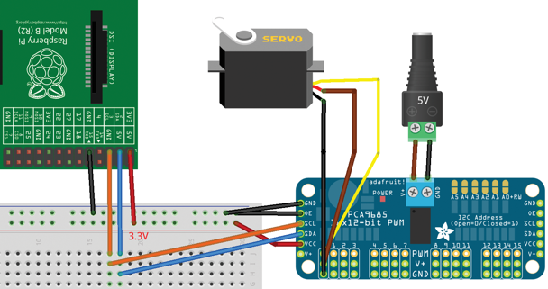

PCA9685 ROS package
=======

`ros_pca9685` is a package  for talking to the PCA9685 I<sup>2</sup>C PWM driver by NXP

PCA9685 Highlights from [datasheet](http://www.nxp.com/documents/data_sheet/PCA9685.pdf)
--------

*	**16 individually controlled channels**
*	**12bit (4096 steps) registers both for on and off time**
*	**1MHz fast I<sup>2</sup>C bus interface with 30mA high drive capability on SDA output for driving high capacitive buses**
*	**40MHz to 1000MHz PWM frequency for all LEDs with internal 25MHz oscillator**
*	**Operating power supply voltage range of 2.3 V to 5.5 V**
*	**Six hardware address pins allow up to 62 devices on the same bus**

Usage on Raspberry PI
=====================
Package tested with [Adafruit 16-Channel 12-bit PWM/Servo Driver] (http://adafruit.com/products/815)

How to configure Raspberry PI described [here] (https://learn.adafruit.com/adafruit-16-channel-servo-driver-with-raspberry-pi/overview)

Circuit
-------



Install
===============

```bash
    mkdir -p ~/pca_ws/src
    cd  ~/pca_ws
    catkin_init_workspace
    cd ~/pca_ws/src
    git clone https://github.com/dennn66/ros_pca9685
    cd ~/pca_ws/src/ros_pca9685/ros_pca9685/src/lib/
    git clone https://github.com/TeraHz/I2C
    git clone https://github.com/TeraHz/PCA9685
    cd ~/pca_ws
    catkin_make_isolated
```
Run
================

```bash
    rosrun ros_pca9685 controller_sub
```

Pub/Sub
=================

Publish
-----------

Subscribe
-----------
* /pca9685/servostate_to_controller (pca9685_msgs/ServoState): move servo (angle in range: -Pi .. Pi)
* /pca9685/pwmstate_to_controller   (pca9685_msgs/PwmState)  : set pulse margins (on_value: 0..4096, off_value: 0..4096)

Test
=================

```
   rostopic pub  /pca9685/servostate_to_controller pca9685_msgs/ServoState '{port_num: 1, servo_rot: 0.5, servo_type: 2}' --once
   rostopic pub  /pca9685/pwmstate_to_controller pca9685_msgs/PwmState '{port_num: 1, on_value: 0, off_value: 400}' --once

```
Turn off servos
=================

Stop all servos:
```
rostopic pub /pca9685/servostate_to_controller pca9685_msgs/ServoState '{port_num: 0, servo_rot: 0.0, servo_type: 0}' --once

```

Stop servo:

```
rostopic pub /pca9685/servostate_to_controller pca9685_msgs/ServoState '{port_num: 1, servo_rot: 0.0, servo_type: 0}' --once

```

or

```
  rostopic pub  /pca9685/pwmstate_to_controller pca9685_msgs/PwmState '{port_num: 1, on_value: 0, off_value: 0}' --once

```


